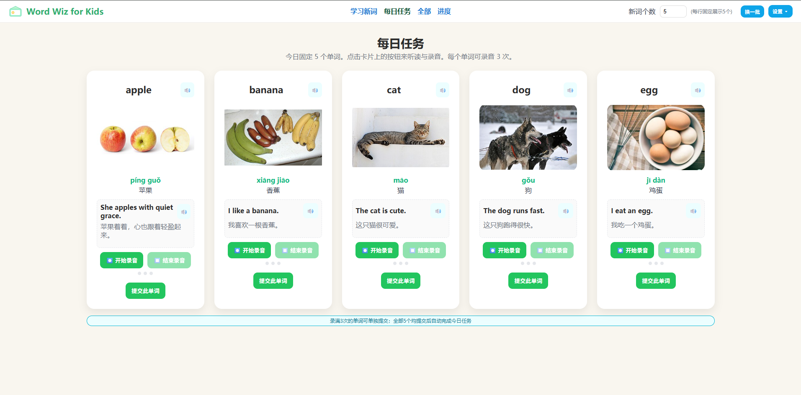
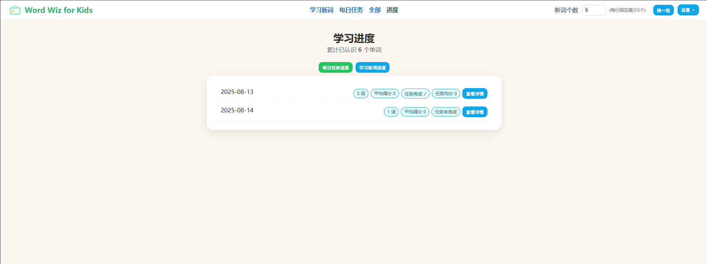
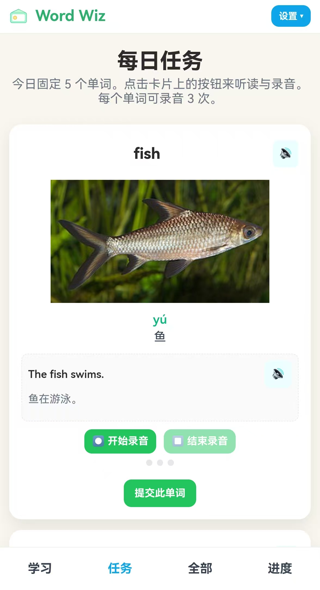

## Word Wiz for Kids — 项目说明与启动指南

本项目是一个纯前端的儿童英语单词小应用，内置本地数据与录音/简单发音评分功能。为保证浏览器可以正确读取本地资源并使用权限接口，请务必通过本地 Web 服务器启动，而不是直接双击打开 `index.html`。

### 目录结构（核心）
- `index.html`: 桌面端入口页面
- `mobile.html`: 移动端入口页面（UI 单列布局、底部导航，数据与桌面端互通）
- `styles.css`: 通用样式
- `styles.mobile.css`: 仅在移动端入口中引入的样式，不影响桌面端
- `scripts/`: 前端业务脚本
  - `app.js`: 主应用逻辑（路由/渲染/录音/提交/进度）
  - `recorder.js`: 麦克风录音与简易发音评分
  - `storage.js`: 本地存储（localStorage + IndexedDB）及数据结构
  - `data/words_loader.js`: 加载/导出词表、补全拼音与图片工具
  - 其他：`sentence_gen.js`（例句生成）、`utils.js`（工具函数）
- `server.py`: 轻量后端（Flask）
  - 录音上传/删除：`/api/recordings`、`DELETE /api/recordings/<name>`
  - 进度同步：`/api/progress*`（见“数据模型与同步”）
  - 移动端：根据 UA 自动跳转 `/mobile`；可用 `/switch-view` 强制切换
- `data/words.csv`: 词表数据
- `assets/`: 静态资源（`words/` 图片、`records/` 录音）
- `start_word_wiz.ps1`/`start_word_wiz.bat`: 本地一键启动脚本

---

### 启动与访问
#### Windows（PowerShell，一键）
方式一：文件管理器中右键 `start_word_wiz.ps1` → 选择“使用 PowerShell 运行”。

方式二：在 PowerShell 中执行（每条命令单独执行）：
1) 切换到项目根目录（包含 `index.html` 的目录）
```powershell
cd <你的项目根目录>
```
2) 启动（默认端口 8080）
```powershell
./start_word_wiz.ps1
```
3) 指定端口（可选）
```powershell
./start_word_wiz.ps1 -Port 9000
```

说明：脚本会优先使用本地 `.venv`；若未检测到系统 Python，将自动下载便携式 Python（一次性），无需安装。

提示：若遇到执行策略限制，可在当前会话临时放开后再运行脚本（两条命令分别执行）：
```powershell
Set-ExecutionPolicy -Scope Process -ExecutionPolicy Bypass
./start_word_wiz.ps1
```

#### Windows（批处理，一键）
前提：已安装 Python 3 且已加入 PATH。

1) 在命令提示符（CMD）中进入项目根目录：
```bat
cd <你的项目根目录>
```
2) 启动：
```bat
start_word_wiz.bat
```

脚本会启动 Flask 服务（默认端口在 `.bat` 里为 18080，在 PS 脚本里可自定），并打开浏览器。

#### 手动方式（Windows/macOS/Linux）
前提：已安装 Python 3。

1) 进入项目根目录（包含 `index.html` 的目录）
```bash
cd <你的项目根目录>
```
2) 启动本地服务器（默认端口 8080）：
```bash
python -m http.server 8080
```
3) 打开浏览器访问：`http://localhost:8080/`（按你的端口修改）

---

### 常见问题
- 端口被占用：
  - PowerShell 脚本：改用 `-Port` 参数（例如 `-Port 9000`）。
  - 手动启动：将命令中的 `8080` 改为其他未占用端口。
- 浏览器兼容：
  - 录音与简单发音评分依赖浏览器的麦克风与语音识别能力。推荐使用最新的 Chrome 或 Edge。
  - 某些浏览器（如 Firefox、部分 Safari 版本）可能不支持语音识别 API，届时“评分”功能会降级，但录音与回放仍可用。
- 麦克风权限：首次使用请允许站点访问麦克风；如被阻止，请在浏览器地址栏右侧的权限设置中手动放开。
- 不要直接用文件协议打开：请通过本地服务器访问，避免 `fetch` 加载 `data/words.csv` 失败或权限接口受限。

---

### 产品流程与页面逻辑
1) 顶部导航（居中）：`学习新词 / 每日任务 / 全部 / 进度`
   - 桌面端位于 header 中央；移动端位于底部 TabBar。
2) 学习新词
   - 右上“新词个数”控制随机批次数量；“换一批”刷新批次。
   - 每个词可录音 3 次；满 3 次后可“提交此单词”（学习分支）。
3) 每日任务（默认首页）
   - 每日固定 5 词；每词需录满 3 条录音后可提交。
   - 当天 5 个词全部提交后，自动判定“任务已完成”，顶部显示绿色横幅“任务已完成 ✓”。
4) 全部
   - 支持搜索、分页、替换图片（保存到本地 assets/words/）。
5) 进度
   - 分为“每日任务进度 / 学习新词进度”两个分支，互不影响。
   - 详情页展示已提交单词的录音与得分、提交时间。

### 数据模型与同步
- 本地存储（`storage.js`）
  - localStorage 键 `ww4k.v1`
    - `days[dayKey]`
      - `recordings`: 每日任务录音（wordId -> [三条尝试]）
      - `learnRecordings`: 学习新词录音
      - `submittedWordIds`, `submittedAtMap`
      - `taskCompleted`, `taskAvgScore`
  - IndexedDB（`ww4k.db`）存储音频 Blob（键：`day|kid|word|idx`）
- 服务端存储（`server.py`）
  - `data/progress.json`，按日分支：
    ```json
    {
      "days": {
        "YYYY-MM-DD": {
          "task": { "recordings": {"wordId": [{"url":"...","score":0.8,"ts":...}]}, "submittedWordIds": [], "submittedAtMap": {}, "taskCompleted": false, "taskAvgScore": 0 },
          "learn": { "recordings": {"wordId": [...]}, "submittedWordIds": [], "submittedAtMap": {} }
        }
      }
    }
    ```
  - 接口：
    - `POST /api/recordings` 上传音频，返回 `assets/records/<file>`
    - `POST /api/progress/recording` 追加录音（`kind=task|learn`，去重：url+ts）
    - `POST /api/progress/submit-word` 记录提交时间（1 秒节流）
    - `POST /api/progress/complete-task` 记录任务完成与平均分
    - `GET /api/progress/<day>` / `GET /api/progress` 拉取进度

### 设置菜单按钮说明
- 切换到手机版/桌面版：调用 `/switch-view` 写入 Cookie，异常时提示“暂时不支持切换”
- 清理缓存：清空 localStorage/SessionStorage 并刷新
- 设置图片目录：授权一个目录以写入/替换 `assets/words/` 图片
- 设置录音目录：授权一个目录以写入 `assets/records/`（优先使用后端上传，无需授权）
- 设置 CSV 文件：授权 `data/words.csv` 以便直接覆盖保存
- 导入词表：CSV/TXT 合并新词（自动补全拼音/例句，可选图片本地化）
- 一键补全 CSV 并本地化图片：为缺失项补全并把远程图下载到本地目录
- 导出更新后的 CSV：下载内存中的词表
- 保存到 CSV（本地写入）：直接覆盖已授权的 `data/words.csv`

### 录音与评分
- 录音：`MediaRecorder`（webm），每词最多 3 条，若已满则替换最早条目
- 评分：简单语音识别 + 向量余弦相似度，浏览器不支持语音识别时回退为中性分
- 保存策略：优先后端 `/api/recordings` 写到 `assets/records/`，失败再写用户授权目录/IDB

### 移动端适配
- 独立入口 `mobile.html` + `styles.mobile.css`，单列卡片与底部导航
- 自动跳转：根路由根据 UA 判断，或通过“切换到手机版/桌面版”按钮强制切换

### 端口与启动参数
- PowerShell 启动脚本：`./start_word_wiz.ps1 -Port 9000`
- 批处理脚本：修改 `start_word_wiz.bat` 中的 `PORT`

### 安全与稳定
- 服务端写文件使用进程内锁与多次重试，解决 Windows WinError 32 占用问题
- 录音/提交接口做去重与节流，避免快速点击造成冲突

---

## 截图（建议放置到 assets/screenshots/ 目录）

> 你可以将实际界面截图保存到 `assets/screenshots/` 下，并按以下命名即可在 README 直接展示。

| 桌面端 - 每日任务 | 桌面端 - 进度 | 移动端 - 任务 |
| --- | --- | --- |
|  |  |  |

> 若图片暂未就绪，上述占位会显示为断链，等你把截图放到指定路径即可。

---

## API 示例（请求/响应样例）

以下示例默认服务运行在 `http://localhost:8080`，按需替换主机与端口。

### 1) 上传录音

请求（multipart/form-data）：
```bash
curl -X POST "http://localhost:8080/api/recordings" \
  -F "audio=@./assets/records/example.webm" \
  -F "word=apple"
```

响应：
```json
{ "ok": true, "url": "assets/records/apple_20250101_123000_ab12cd.webm", "filename": "apple_20250101_123000_ab12cd.webm" }
```

### 2) 追加录音到进度（服务端存档）

```bash
curl -X POST "http://localhost:8080/api/progress/recording" \
  -H "Content-Type: application/json" \
  -d '{
    "day":"2025-08-13",
    "wordId":"101",
    "url":"assets/records/apple_20250101_123000_ab12cd.webm",
    "score":0.86,
    "ts": 1734144000000,
    "transcript":"apple",
    "kind":"task"  
  }'
```

响应：
```json
{ "ok": true }
```

### 3) 提交单词

```bash
curl -X POST "http://localhost:8080/api/progress/submit-word" \
  -H "Content-Type: application/json" \
  -d '{ "day":"2025-08-13", "wordId":"101", "ts":1734144000000, "kind":"task" }'
```

响应：
```json
{ "ok": true }
```

### 4) 完成今日任务

```bash
curl -X POST "http://localhost:8080/api/progress/complete-task" \
  -H "Content-Type: application/json" \
  -d '{ "day":"2025-08-13", "taskAvgScore":0.78 }'
```

响应：
```json
{ "ok": true }
```

### 5) 查询进度

- 某一天：
```bash
curl "http://localhost:8080/api/progress/2025-08-13"
```

响应（示例片段）：
```json
{
  "ok": true,
  "dayKey": "2025-08-13",
  "day": {
    "task": {
      "recordings": { "101": [{"url":"assets/records/...","score":0.86,"ts":1734144000000}] },
      "submittedWordIds": [101],
      "submittedAtMap": {"101": 1734144010000},
      "taskCompleted": true,
      "taskAvgScore": 0.82
    },
    "learn": {
      "recordings": {},
      "submittedWordIds": [],
      "submittedAtMap": {}
    }
  }
}
```

- 全部日期：
```bash
curl "http://localhost:8080/api/progress"
```

---

## 运维部署（Nginx / HTTPS）

你可以直接运行 `python server.py --host 0.0.0.0 --port 8080` 暴露服务，再用 Nginx 做反向代理与 HTTPS。示例：

```nginx
server {
  listen 80;
  server_name example.com;
  return 301 https://$host$request_uri;
}

server {
  listen 443 ssl http2;
  server_name example.com;

  ssl_certificate     /etc/letsencrypt/live/example.com/fullchain.pem;
  ssl_certificate_key /etc/letsencrypt/live/example.com/privkey.pem;

  # 提升静态资源缓存
  location ~* \.(js|css|png|jpg|jpeg|webp|svg|ico|woff2?)$ {
    proxy_pass http://127.0.0.1:8080;
    add_header Cache-Control "public, max-age=2592000";
  }

  # 其余流量走后端（含 API 与 HTML）
  location / {
    proxy_set_header Host $host;
    proxy_set_header X-Forwarded-For $proxy_add_x_forwarded_for;
    proxy_set_header X-Forwarded-Proto $scheme;
    proxy_pass http://127.0.0.1:8080;
  }
}
```

快速脚本参考：`setup_https_nginx.sh`（内含示例 server 块与证书自动续期提示）。

### 生产注意事项
- 建议将 `assets/records/` 与 `data/progress.json` 做周期性备份
- 对 `/api/progress/*` 增加简单访问控制（如 Basic Auth 或内网访问）
- 若部署在多实例环境，请把 `data/progress.json` 存放在共享存储或改为数据库


---

### 目录打开位置说明（重要）
无论使用脚本还是手动方式，请确保启动的工作目录就是包含 `index.html` 的目录。脚本会自动处理常见的嵌套目录情况。

---

### 开发提示
- 代码均为前端静态资源，无需安装依赖。
- 如需在其他本地服务器（Nginx、Node 等）部署，只要将项目根目录作为静态目录暴露即可。


